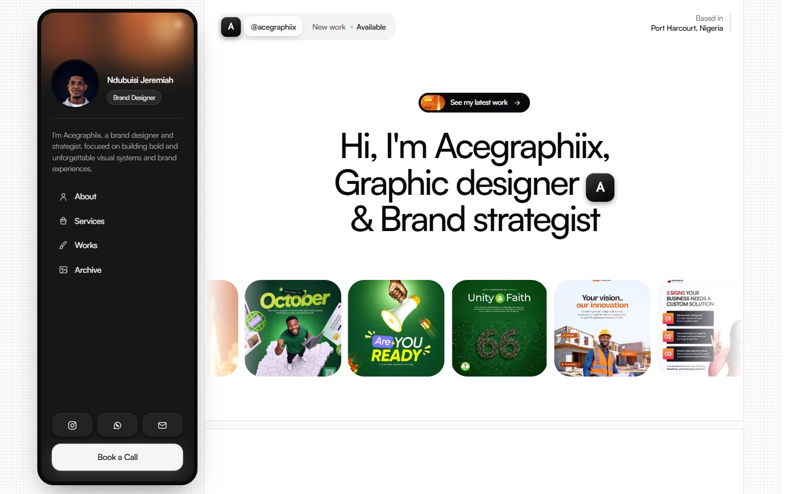
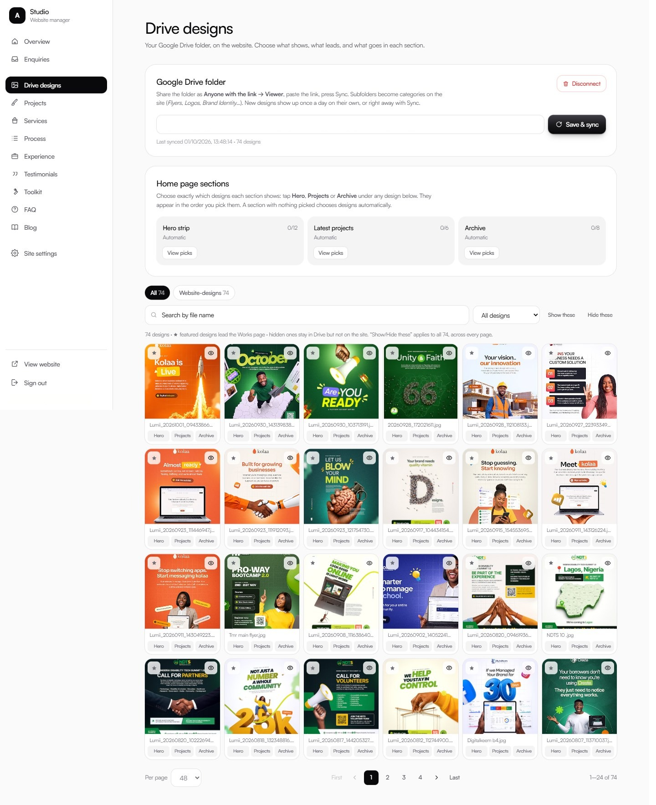

# Acegraphiix — designer portfolio + CMS/CRM

A portfolio website and self-serve dashboard for **Ndubuisi Jeremiah (Acegraphiix)**, a graphic designer and brand
strategist in Port Harcourt, Nigeria. His designs stream straight from a Google Drive folder. Everything else (copy,
pricing, projects, testimonials, blog) and every client enquiry is managed from `/dashboard`.



**Stack:** Next.js 15 (App Router) · React 19 · TypeScript · Tailwind CSS 3 · Supabase (Postgres, Auth, Storage, RLS) ·
Google Drive API v3 · Resend · Vercel (hosting + cron)

---

## What it does

**Public site**
- Pages: home, about, services, works (with case-study pages), archive, blog, contact.
- His four ₦ service packages, a 4-step process, his experience, a philosophy statement, testimonials, his toolkit, FAQs.
- A contact form that feeds the CRM.
- Designs come live from Google Drive. Subfolders become filterable categories, and images are resized and CDN-cached
  through `/api/drive/[id]`.
- Works with no keys: without Supabase it renders his brief from `lib/content/defaults.ts`, so it never crashes on a
  missing key.

**Dashboard (`/dashboard`)**
- **Overview:** counts, new enquiries, and a to-do list of what's still empty.
- **Enquiries (CRM):** pipeline New → Contacted → In progress → Won / Lost → Archived, with private notes, deal value,
  and one-tap reply by email or WhatsApp.
- **Drive designs:**
  - Sync, plus a daily auto-sync.
  - Search, folder and status filters, pagination (24/48/96 per page).
  - Show/hide and feature individual designs, or bulk show/hide.
  - Pick exactly which designs appear in the home page's Hero strip, Latest Projects grid and Archive collage.
  - Disconnect, which removes every synced design from the site.
- **Content editors:** projects, services, process, experience, testimonials, toolkit, FAQ, blog, and site settings
  (copy, photos, contact details, SEO). Every save updates the live site immediately.
- **Sign-in:** a 6-digit code emailed to him, or a password. Only emails in the `admins` table can edit.



---

## Run it locally

```bash
npm install
cp .env.example .env.local   # fill in what you have
npm run dev
```

## Set it up (once, ~30 minutes)

### 1. Supabase
1. Create a project (free tier is enough).
2. SQL Editor → run, in order:
   - `supabase/schema.sql`
   - `supabase/seed.sql`
   - every file in `supabase/migrations/`

   The seed loads his content and makes **acegraphiix@gmail.com** the admin. To add another admin:
   `insert into admins (email) values ('you@example.com');`
3. Authentication → **Email Templates**: paste each file from `supabase/templates/`. The subject lines are in
   `SUBJECTS.txt`.

   | Template file | Supabase template |
   |---|---|
   | `confirm-signup.html` | Confirm signup |
   | `magic-link.html` | Magic Link |
   | `reset-password.html` | Reset Password |
   | `invite.html` | Invite user |
   | `change-email.html` | Change Email Address |

   The sign-in emails show the 6-digit code and a button that works in any browser.
4. Authentication → **URL Configuration**:
   - Site URL = the live domain.
   - Redirect URLs: add `https://<domain>/**` and `http://localhost:3000/**`.
5. Copy the project URL, anon key and service-role key into the env vars.

### 2. Google Drive
1. **He shares the folder:** right-click his `website-designs` folder → Share → **Anyone with the link → Viewer**.
   - Optional: subfolders inside it (`Logos`, `Flyers`, `Brand Identity`…) become categories on the site. Images
     loose in the top folder are grouped under the folder's own name.
2. **You create the API key:**
   1. console.cloud.google.com → new project → APIs & Services → Library → enable **Google Drive API**.
   2. Credentials → **Create API key** → API restrictions → **Drive API only**. Leave application restrictions on "None",
      because the site calls Drive from the server.
   3. Save it as `GOOGLE_API_KEY`.
3. **Connect it:** dashboard → **Drive designs** → paste the folder link → **Save & sync**.

**Storage:**
- Sync stores only a small text record per design in Postgres: id, name, folder, size and the section picks. The
  images are not copied into Supabase.
- Visitors get images through `/api/drive/[id]`, which fetches a resized version from Drive. Vercel's CDN caches it
  for a year, so Drive is asked roughly once per image per size.
- Supabase Storage holds only what he uploads by hand: project covers, testimonial photos, blog images (15 MB each,
  1 GB on the free tier).

**Sync behaviour:**
- New Drive files appear on the next sync.
- Deleted Drive files disappear from the site.
- His dashboard choices (hidden, featured, category, section picks) survive every sync.
- A daily sync runs at 05:00 UTC (`vercel.json`).
- PSD and AI files in the folder are ignored.

### 3. Email notifications (Resend)
1. resend.com → API Keys → create one with sending access.
2. Set the env vars:
   - `RESEND_API_KEY` = the key
   - `NOTIFY_EMAIL` = where enquiries go
3. Until a domain is verified, Resend only sends from `onboarding@resend.dev` to the Resend account's own email.
   So either sign up to Resend with his address, or verify his domain (Resend → Domains → add the DNS records) and set
   `NOTIFY_FROM="Acegraphiix Website <hello@hisdomain.com>"`.
4. Recommended once a domain is verified: send Supabase's sign-in emails through Resend too. Supabase's built-in
   mailer allows only a few emails an hour. Go to Supabase → Authentication → SMTP Settings:

   | Field | Value |
   |---|---|
   | Host | `smtp.resend.com` |
   | Port | `465` |
   | User | `resend` |
   | Password | the Resend API key |

### 4. Vercel
1. Import the repo.
2. Add the env vars below.
3. Deploy, then add the domain.

`NEXT_PUBLIC_*` values are read at build time, so redeploy after changing one.

| Variable | Where it comes from |
|---|---|
| `NEXT_PUBLIC_SITE_URL` | the live domain, e.g. `https://acegraphiix.com` |
| `NEXT_PUBLIC_SUPABASE_URL` | Supabase → Settings → API |
| `NEXT_PUBLIC_SUPABASE_ANON_KEY` | Supabase → Settings → API |
| `SUPABASE_SERVICE_ROLE_KEY` | Supabase → Settings → API (server only; used by the daily sync) |
| `GOOGLE_API_KEY` | Google Cloud, above |
| `CRON_SECRET` | any long random string: `openssl rand -hex 32`. Vercel sends it to the cron route automatically |
| `RESEND_API_KEY`, `NOTIFY_EMAIL`, `NOTIFY_FROM` | Resend, above (optional) |

To test the sync route by hand:

```bash
curl -H "Authorization: Bearer $CRON_SECRET" https://<domain>/api/drive/sync
```

On the Hobby plan, Vercel cron runs at most once a day, which is what this uses.

---

## Resetting after testing

In order, in Supabase → SQL Editor unless noted.

**1. Remove the synced test designs.** Dashboard → Drive designs → **Disconnect**. That clears the folder link and
every synced design, and leaves Google Drive untouched. Or in SQL:

```sql
delete from gallery_items;
update settings set data = data - 'drive_folder_url' where id = 1;
```

**2. Remove the test enquiries.**

```sql
delete from enquiries;
```

**3. Remove a test login** (replace the email):

```sql
delete from admins where email = 'test@example.com';
delete from auth.users where email = 'test@example.com';
```

You can also delete the user in Authentication → Users.

**4. Remove test uploads.** Storage → `media` bucket → delete the files.

Then reconnect his real folder from the dashboard and press Save & sync.

---

## How it's built

```
app/(site)/            public pages
app/dashboard/         CMS/CRM, admin-gated
app/api/drive/         [id] image proxy · sync (cron)
app/auth/callback/     email-link sign-in (token hash or PKCE code)
components/site/       sidebar card, sections, gallery, testimonials, contact footer
components/dashboard/  shell, collection manager, enquiries, Drive designs manager, form fields
lib/content/           types, defaults (his brief), queries, section picking
lib/cms/collections.ts one declaration per content type → drives every editor
lib/drive.ts           Drive sync + image fetch
lib/email/enquiry.ts   HTML enquiry notification
supabase/              schema.sql · seed.sql · migrations/ · templates/ (auth emails)
```

**Principles**
- **Row-level security is the boundary.** Visitors can read published rows and insert an enquiry, nothing else. Only
  `admins` can write. Server actions re-check, but only to give clearer errors.
- **The CMS failing never takes the site down.** Each section falls back to its default and logs a warning.
- **No invented content.** Testimonials stay hidden until real ones are added.
- **The image proxy is not an open proxy.** It only serves ids that are in the gallery.

---

## Credits

Designed and built by **Kymaa Digital Solutions** for Acegraphiix. The layout is inspired by a Framer portfolio template
and rebuilt from scratch in Next.js with his own content.
